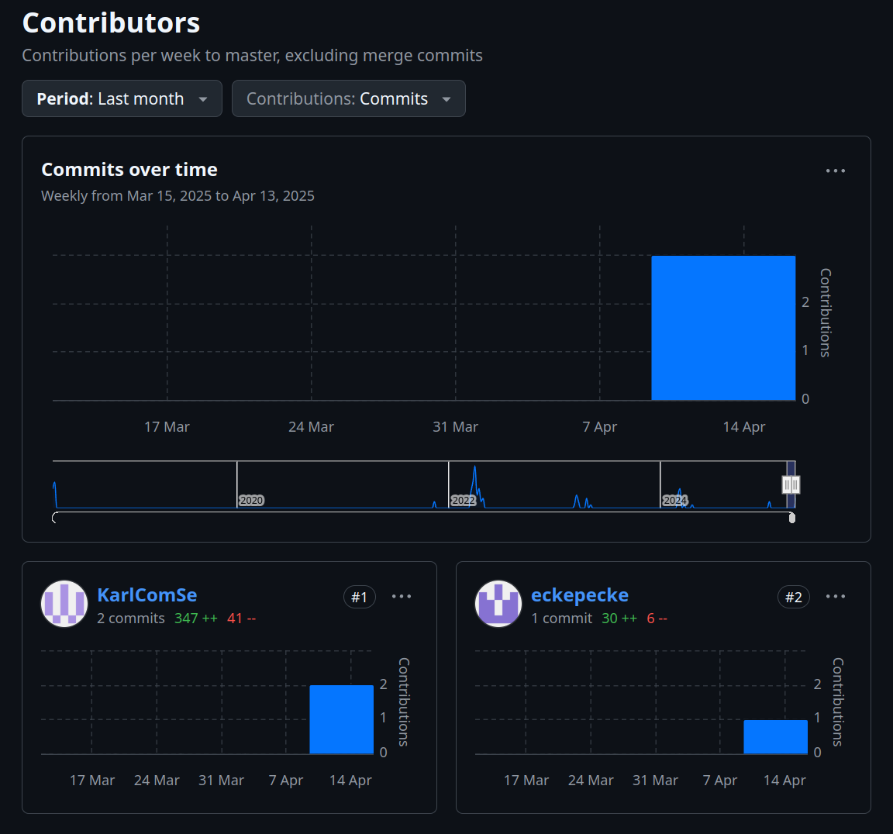

# PA1417 Basic System Verification - Lab Assignments

## Team Information

- Team Member 1: Erik O.
- Team Member 2: Karl W.

# Assignment 0: Setup 

## 1. Group work

1. Names of the two team members: Erik O., Karl W.
2. Group number on Canvas: 25

## 2. Testing system

1. Link to the fork of the edutask repository: https://github.com/eckepecke/bsv-edutask 

2. A screenshot showing that both team members are collaborators in the repository: 
