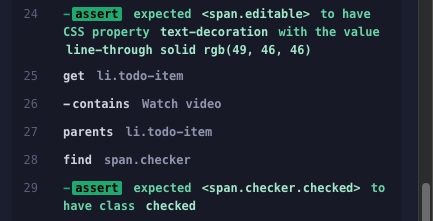

# PA1417 Basic System Verification - Assignment 4: GUI Testing

## Team Information

- Team Member 1: Erik O.
- Team Member 2: Karl W.

## Work Distribution

- Team Member 1: Erik O. made the majority of the assignment. 
- Team Member 2: Karl W. reviewed the hand-in and code, complemented the written text somewhat. Claude (a LLM-model) was used to refactor some of the code.

## 1. Graphical User Interface Tests

### List of Test Cases for Requirement 8

#### R8UC1: Create Todo Items 

Preconditions: The user is authenticated, has at least one task associated to his account, and
views this task in detail view mode.

| Test | Condition       | Action          | Outcome                                 |
| ---- | --------------- | --------------- | --------------------------------------- |
| 1    | Field empty     | User clicks Add | Nothing happens, Add button is disabled |
| 2    | Field not empty | User clicks Add | Active task created at bottom of list   |

#### R8UC2: Toggle Todo Items

Preconditions: The user is authenticated, has at least one task with at least one todo item
associated to his account, and views this task in detail view mode.

| Test | Condition      | Action           | Outcome          |
| ---- | -------------- | ---------------- | ---------------- |
| 1    | Task is active | User clicks icon | Status -> Done   |
| 2    | Task is done   | user clicks icon | Status -> Active |

#### R8UC3: Delete Todo Items

Preconditions: The user is authenticated, has at least one task with at least one todo item
associated to his account, and views this task in detail view mode.

| Test | Status | Action             | Outcome      |
| ---- | ------ | ------------------ | ------------ |
| 1    | Active | User clicks x-icon | Item deleted |

### Implementation of Test Cases using Cypress

[Link to Cypress test code in repository: https://github.com/eckepecke/bsv-edutask/tree/master/frontend/cypress/e2e]

### Test Execution Results

#### Adding to do item : addTaskInDetailedView.cy.js / R8UC1

##### Test case 1

Output shows that the first test passed. Adding an item with content in the input field is creating a new todo-item.


##### Test case 2 

Output shows that the Add button is not disabled when input field is empty.


#### Toggling existing item : toggleTask.cy.js / R8UC2

##### Test case 1 and 2

Output shows that toggling to "Done" is working.




Output shows that toggling back to active is also working.


#### Removing item : deleteTodoItem.cy.js / R8UC3

##### Test case 1

Output shoes that item is removed successfully.


## 2. Declarative vs. Imperative UI Testing

### 2.1 Explanation

#### Imperative (White-Box) Testing

In imperative UI testing, tests explicitly define how to locate and interact with elements by relying on the application's internal structure (e.g., DOM hierarchy, CSS classes, IDs, or XPaths). For example:

```javascript
cy.get('#login-form > input[type="email"]').type("user@example.com");
```

Here, the test directly references specific DOM properties. This approach requires knowledge of the implementation details, making it brittle—if the UI structure changes (e.g., a CSS class is renamed), the test breaks.

#### Declarative (Black-Box) Testing

Declarative tests focus on what the user sees and interacts with, abstracting away implementation details. Elements are identified by their visible characteristics, such as text, labels, ARIA roles, or semantic HTML tags. For example:

```javascript
cy.findByRole("button", { name: "Submit" }).click();
```

This mimics how a user navigates the UI, relying on attributes like button labels. Tests become resilient to structural changes (e.g., CSS renames) as long as the visible behavior remains consistent.

### 2.2 Discussion: Which Approach is Most Applicable for UI Testing?

#### Declarative Testing is Generally Preferable

UI tests aim to verify that the application behaves correctly from the user's perspective. Declarative tests align with this goal by using the same cues (e.g., button labels, form placeholders) that guide real users.

Imperative tests tightly couple to the DOM structure, making them prone to breaking during refactoring (e.g., changing a `<div id="submit"> to <button class="submit-btn">`). Declarative tests avoid this by depending on stable, user-facing attributes.

Tests written declaratively are easier to understand and modify because they reflect the intent of the interaction (e.g., "click the 'Login' button") rather than technical details.

**Conclusion**

Declarative testing should probably be the standard approach for UI automation, as it prioritizes user experience and reduces maintenance costs.