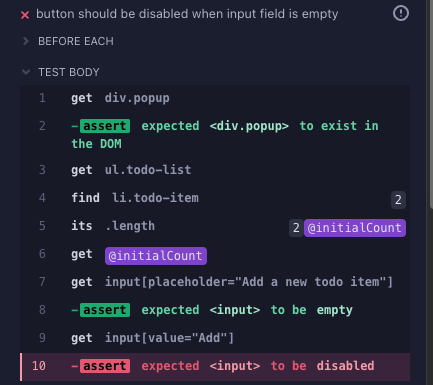
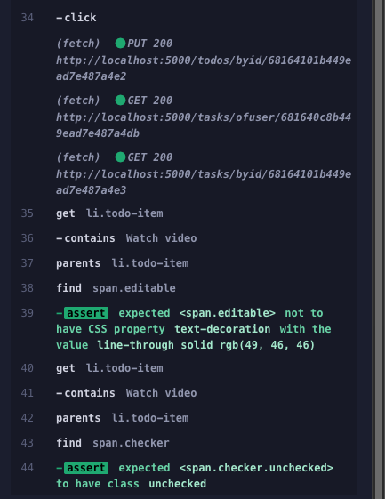

# Test cases Assignment 1

## ID: R8UC1

Preconditions: The user is authenticated, has at least one task associated to his account, and
views this task in detail view mode.

| Test | Field     | Action          | Outcome                                 |
| ---- | --------- | --------------- | --------------------------------------- |
| 1    | Empty     | User clicks Add | Nothing happens, Add button is disabled |
| 2    | Not empty | User clicks Add | Active task created at bottom of list   |

## ID: R8UC2

Preconditions: The user is authenticated, has at least one task with at least one todo item
associated to his account, and views this task in detail view mode.

| Test | Status | Action           | Outcome          |
| ---- | ------ | ---------------- | ---------------- |
| 1    | Active | User clicks icon | Status -> Done   |
| 2    | Done   | user clicks icon | Status -> Active |

## ID: R8UC3

Preconditions: The user is authenticated, has at least one task with at least one todo item
associated to his account, and views this task in detail view mode.

| Test | Status | Action             | Outcome      |
| ---- | ------ | ------------------ | ------------ |
| 1    | Active | User clicks x-icon | Item deleted |

# Test Execution Output

## Adding to do item

### Test case 1

Output shows that the first test passed. Adding an item with content in the input field is creating a new todo-item.


### Test case 2

Output shows that the Add button is not disabled when input field is empty.


## Toggling existing item

### Test case 1 and 2

Output shows that toggling to "Done" is working.


Output shows that toggling back to active is also working.


## Removing item

### Test case 1

Output shoes that item is removed successfully.


Declarative vs Imperative Discussion

# 1. Explanation of Declarative and Imperative UI Test Case Implementation

## Imperative (White-Box) Testing

In imperative UI testing, tests explicitly define how to locate and interact with elements by relying on the application’s internal structure (e.g., DOM hierarchy, CSS classes, IDs, or XPaths). For example:

```javascript
cy.get('#login-form > input[type="email"]').type("user@example.com");
```

Here, the test directly references specific DOM properties. This approach requires knowledge of the implementation details, making it brittle—if the UI structure changes (e.g., a CSS class is renamed), the test breaks.

## Declarative (Black-Box) Testing

Declarative tests focus on what the user sees and interacts with, abstracting away implementation details. Elements are identified by their visible characteristics, such as text, labels, ARIA roles, or semantic HTML tags. For example:

```javascript
cy.findByRole("button", { name: "Submit" }).click();
```

This mimics how a user navigates the UI, relying on attributes like button labels. Tests become resilient to structural changes (e.g., CSS renames) as long as the visible behavior remains consistent.

# 2. Discussion: Which Approach is Most Applicable for UI Testing?

## Declarative Testing is Generally Preferable

UI tests aim to verify that the application behaves correctly from the user’s perspective. Declarative tests align with this goal by using the same cues (e.g., button labels, form placeholders) that guide real users.

Imperative tests tightly couple to the DOM structure, making them prone to breaking during refactoring (e.g., changing a `<div id="submit"> to <button class="submit-btn">`). Declarative tests avoid this by depending on stable, user-facing attributes.

Tests written declaratively are easier to understand and modify because they reflect the intent of the interaction (e.g., “click the ‘Login’ button”) rather than technical details.

Conclusion
Declarative testing should probably be the standard approach for UI automation, as it prioritizes user experience and reduces maintenance costs.

# Assignment 2

## Explanation why definition of quality is necessary

Different systems serve different purposes, so the concept of quality can vary widely depending on the context. In a game application, quality might relate to the user experience. For example, how engaging or enjoyable the game is, or to technical aspects such as frame rate (FPS) and responsiveness.s. On an online poker site, framerate does not matter. Quality would instead refer to perhaps stability, making sure that users are not disconnected during play.

Given that quality can take many different forms, it becomes essential to decide what it means. If you dont pin-point what quality is, testing becomes difficult since there is no clear aim for test-engineers to work with.

## Explanation of three qualities

### Reliability

Reliability is the ability of software to perform its tasks under certain conditions for a certain amount of time without failing. For example:

- **Probability of failure-free operation**: Depending on the context, the threshold for reliability can vary.

  - In a **video streaming platform**, a 90% success rate (0.9) might be considered acceptable, as occasional buffering or failure to load may not have critical consequences.

  - In a **flight navigation system** or a **medical monitoring device**, even a 99% success rate (0.99) could be unacceptable, since failures may lead to life-threatening situations.

- **The ability to recover from failures**: A reliable system should not crash or become unusable due to common or expected issues, such as invalid user input. Instead, it should handle such cases gracefully. For example:

  - If a user enters an invalid data type (e.g., text instead of a number), the system should display an error message and prompt for the correct input, rather than crashing.

  - In a payment processing system, if a network connection fails mid-transaction, the system should be able to detect the failure and either retry the request or roll back the transaction to ensure consistency.

  - In a web application, if a backend service is temporarily unavailable, the system might display a friendly error message and automatically attempt to reconnect.

### Maintainability

Maintainability refers to how easy it is to modify, correct,defect, improve performance etc. Some examples are:

- Code readability
- Component independence and modularity
- Documentation quality
- How difficult it is to identify and fix defects

### Accessibility
