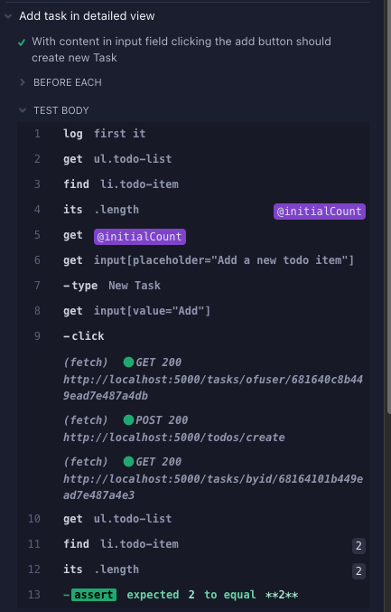
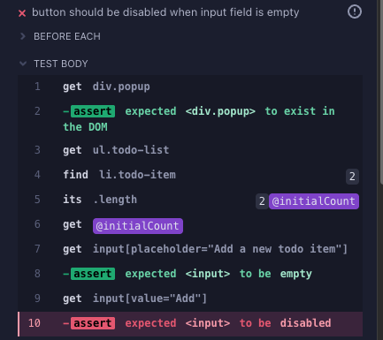
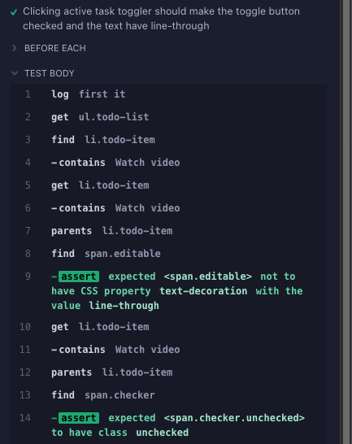
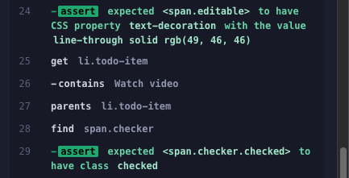
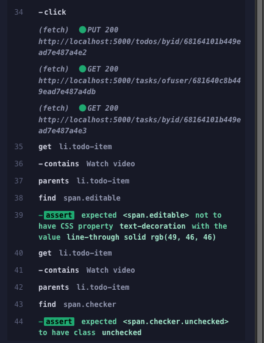
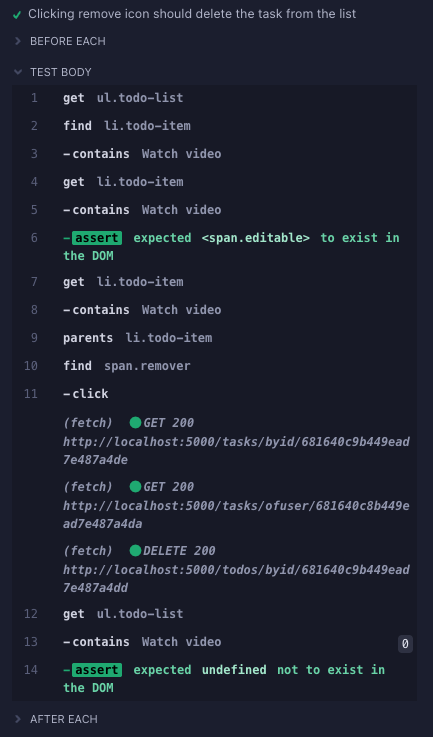

# PA1417 Basic System Verification - Lab Assignments 4-6

## Team Information

- Team Member 1: Erik O.
- Team Member 2: Karl W.

## Work Distribution

For Assignment 4:

- Team Member 1: Erik O. made the majority of the assignment. 
- Team Member 2: Karl W. reviewed the hand-in and code, complemented the written text somewhat. Claude (a LLM-model) was used to refactor some of the code.

For Assignment 5:

- Team Member 1: [Contributions]
- Team Member 2: [Contributions]

For Assignment 6:

- Team Member 1: [Contributions]
- Team Member 2: [Contributions]

# Assignment 4: GUI Testing

## 1. Graphical User Interface Tests

### List of Test Cases for Requirement 8

#### R8UC1: Create Todo Items 

Preconditions: The user is authenticated, has at least one task associated to his account, and
views this task in detail view mode.

| Test | Condition       | Action          | Outcome                                 |
| ---- | --------------- | --------------- | --------------------------------------- |
| 1    | Field empty     | User clicks Add | Nothing happens, Add button is disabled |
| 2    | Field not empty | User clicks Add | Active task created at bottom of list   |

#### R8UC2: Toggle Todo Items

Preconditions: The user is authenticated, has at least one task with at least one todo item
associated to his account, and views this task in detail view mode.

| Test | Condition      | Action           | Outcome          |
| ---- | -------------- | ---------------- | ---------------- |
| 1    | Task is active | User clicks icon | Status -> Done   |
| 2    | Task is done   | user clicks icon | Status -> Active |

#### R8UC3: Delete Todo Items

Preconditions: The user is authenticated, has at least one task with at least one todo item
associated to his account, and views this task in detail view mode.

| Test | Status | Action             | Outcome      |
| ---- | ------ | ------------------ | ------------ |
| 1    | Active | User clicks x-icon | Item deleted |

### Implementation of Test Cases using Cypress

[Link to Cypress test code in repository: https://github.com/eckepecke/bsv-edutask/tree/master/frontend/cypress/e2e]

### Test Execution Results

#### Adding to do item : addTaskInDetailedView.cy.js / R8UC1

##### Test case 1

Output shows that the first test passed. Adding an item with content in the input field is creating a new todo-item.



##### Test case 2 

Output shows that the Add button is not disabled when input field is empty.



#### Toggling existing item : toggleTask.cy.js / R8UC2

##### Test case 1 and 2

Output shows that toggling to "Done" is working.





Output shows that toggling back to active is also working.


#### Removing item : deleteTodoItem.cy.js / R8UC3

##### Test case 1

Output shoes that item is removed successfully.


**Test Execution Report:**

[Brief report on test execution, including any failures detected]

## 2. Declarative vs. Imperative UI Testing

### 2.1 Explanation

#### Imperative (White-Box) Testing

In imperative UI testing, tests explicitly define how to locate and interact with elements by relying on the application’s internal structure (e.g., DOM hierarchy, CSS classes, IDs, or XPaths). For example:

```javascript
cy.get('#login-form > input[type="email"]').type("user@example.com");
```

Here, the test directly references specific DOM properties. This approach requires knowledge of the implementation details, making it brittle—if the UI structure changes (e.g., a CSS class is renamed), the test breaks.

#### Declarative (Black-Box) Testing

Declarative tests focus on what the user sees and interacts with, abstracting away implementation details. Elements are identified by their visible characteristics, such as text, labels, ARIA roles, or semantic HTML tags. For example:

```javascript
cy.findByRole("button", { name: "Submit" }).click();
```

This mimics how a user navigates the UI, relying on attributes like button labels. Tests become resilient to structural changes (e.g., CSS renames) as long as the visible behavior remains consistent.

### 2.2 Discussion: Which Approach is Most Applicable for UI Testing?

#### Declarative Testing is Generally Preferable

UI tests aim to verify that the application behaves correctly from the user’s perspective. Declarative tests align with this goal by using the same cues (e.g., button labels, form placeholders) that guide real users.

Imperative tests tightly couple to the DOM structure, making them prone to breaking during refactoring (e.g., changing a `<div id="submit"> to <button class="submit-btn">`). Declarative tests avoid this by depending on stable, user-facing attributes.

Tests written declaratively are easier to understand and modify because they reflect the intent of the interaction (e.g., “click the ‘Login’ button”) rather than technical details.

**Conclusion**

Declarative testing should probably be the standard approach for UI automation, as it prioritizes user experience and reduces maintenance costs.

# Assignment 5: Non-functional Testing

## Explanation why definition of quality is necessary

Different systems serve different purposes, so the concept of quality can vary widely depending on the context. In a game application, quality might relate to the user experience. For example, how engaging or enjoyable the game is, or to technical aspects such as frame rate (FPS) and responsiveness.s. On an online poker site, framerate does not matter. Quality would instead refer to perhaps stability, making sure that users are not disconnected during play.

Given that quality can take many different forms, it becomes essential to decide what it means. If you dont pin-point what quality is, testing becomes difficult since there is no clear aim for test-engineers to work with.

## Explanation of three qualities

### Reliability

Reliability is the ability of software to perform its tasks under certain conditions for a certain amount of time without failing. For example:

- **Probability of failure-free operation**: Depending on the context, the threshold for reliability can vary.

  - In a **video streaming platform**, a 90% success rate (0.9) might be considered acceptable, as occasional buffering or failure to load may not have critical consequences.

  - In a **flight navigation system** or a **medical monitoring device**, even a 99% success rate (0.99) could be unacceptable, since failures may lead to life-threatening situations.

- **The ability to recover from failures**: A reliable system should not crash or become unusable due to common or expected issues, such as invalid user input. Instead, it should handle such cases gracefully. For example:

  - If a user enters an invalid data type (e.g., text instead of a number), the system should display an error message and prompt for the correct input, rather than crashing.

  - In a payment processing system, if a network connection fails mid-transaction, the system should be able to detect the failure and either retry the request or roll back the transaction to ensure consistency.

  - In a web application, if a backend service is temporarily unavailable, the system might display a friendly error message and automatically attempt to reconnect.

### Maintainability

Maintainability refers to how easy it is to modify, correct,defect, improve performance etc. Some examples are:

- Code readability
- Component independence and modularity
- Documentation quality
- How difficult it is to identify and fix defects

To propose some explicit metrics related to above, some examples used in the DBWEBB courses are: linting compliance (compliance to certain code standards with regards to e.g. naming of variables / functions, required docstrings, avoiding certain code constructs, etc.), metric on cyclomatic complexity, cohesion / coupling metrics, code duplication metrics. Some courses have had a requirement for automatic testing with a CI pipeline.  

### Accessibility

Accessibility is the degree to which software can be used by people with the widest range of capabilities. This includes:

- Compliance with established accessibility standards (such as WCAG) to ensure inclusive design.
- Compatibility with tools like screen readers, speech recognition software, screen magnifiers, and alternative input devices.
- Clear, consistent, and simple UI design that supports keyboard navigation, high contrast modes, text resizing, not relying solely on color or visual cues.

### Potential Test Techniques for Each Quality

#### Test Technique for Reliabiltiy:

One way ot test the reliability of the system would be to introduce invalid inputs, trying to break the system. If the system is not taking inputs one might consider a stresstest, putting the system under a heavy workload to see where the breaking points are.

#### Test Technique for Maintainability:

There are various tools for testing this quality, such as, Scrutinizer. Used for code analysis, focusing on maintainability, complexity, duplication, and adherence to best practices. Scrutinizer supports multiple languages, but there are also language specific alternatives that one might choose.

#### Test Technique for Accesibility:

Google Lighthouse is an easy way to test accessability ang get quick feedback on how to improve it. Google Lighthouse can be runned in the browser, from command line or as a node module, making it possible to integrate in an automated testing environment. 

## 2. Static Testing

### Explanation of Static Test Techniques vs. Dynamic Test Techniques

**Static test techniques** are techniques applied to the system under test (SUT) without executing the code. This could be using tools like static code analyzers, linters, code review tools, and documentation reviewers. Specific examples include tools such as SonarQube, or code linters (ESlint etc). This type of analysis could also be done manually with code reviews.

**Dynamic test techniques** are applied to the SUT while the application is running. This could be tools like test execution frameworks, performance monitors, debuggers, coverage analyzers and accessibility checkers. Exploratory testing and user testing are examples of Dynamic Manual Techniques.

### Static Code Review of EduTask System

The assignment defines extensibility as "the ability of a system to be extended with new functionality with minimal or no effects on its internal structure and data flow". The task is to review the systems extensibility in regards to a proposed change, which is to add a different kind of resource (Medium-articles, on top of current YouTube videos). 

The system architecture consists of three parts: 1) mongoDB (database), 2) Flask (backend) and 3) React (frontend). 

This then implies that each of these components must be possible to extend with new functionality with minimal or no effects on its internal structure and data flow. 

The task is to conduct a preliminary code review. Thus, the analysis will stay high level. The conclusion of the evaluation is that the proposed change would be difficult to implement, as the code is not extensible.  

#### Backend

##### Extensibility Evaluation

The system makes consistent use of dependency injection in its controller layer. Each controller class receives its DAO(s) as constructor parameters, allowing different data access objects to be injected at runtime. This design improves testability, and reduces coupling, which in turn improves the extensibility. New controllers and resource types can be added with minimal changes to the existing architecture.

The DAO class is very nice, it allows for an easy way to store new types of resources in MongoDB. The system has a nice modularity with a lot of classes using dependency injection.

##### Evaluation of Adding Medium Articles as a Resource Type

As mentioned above the DAO class already allows for adding new types of resources.

Sadly, the TaskController logic is tightly coupled to Youtube videos.

```
            video = self.videos_dao.create({'url': data['url']})
            del data['url']
            data['video'] = ObjectId(video['_id']['$oid'])
```

This code from the create() method assumes a video Dao, stores the resource in a video field and so on. There is no support here for multiple resource types. Similar problems arise in the populate_task() method. This holds trie for other methods as well, such s the delete_of_user and so on. To support future resource types this section should be refactored to assume a resource and not a video. 

#### Frontend

There are several issues with the frontend and its extensibility. For example, the TaskView.js UI is focused on YouTube and assumes that the content is YouTube videos with Thumbnails. 

```
    <div>
      {tasks.length === 0 ?
        <p>Here you find the space to organize the educational videos you are interested in and associate them with todo items. Start by pasting the view key of a YouTube video as well as a title of the task in the form below.</p>
        : <p>Here you can find your {tasks.length} task{tasks.length === 1 ? '' : 's'}. Click on each thumbnail in the list to add, update, or delete the todo items you have associated to this video.</p>}
      <div className='container'>
        {tasks.map(task =>
          <div className='container-element' key={task.id}>
            <a onClick={() => { setTrigger(true); setFocus(task) }}>
              
              { task.done ? <div className="done-overlay"><div className="done-check"></div></div> : <div></div>}
              <div className="title-overlay">{task.title}</div>
            </a>
          </div>)}

        <div className='container-element' key='newtask'>
          <TaskCreator userid={props.user._id} setTasks={setTasks} />
        </div>
```

The Converter.js also assumes a video, as it attempts to access `taskobj.video.url`. 


#### Database

From an architectural point of view, in general, a document oriented database such as mongoDB could be strong in its capacity to be extensible. However, looking into the implementation here, taking an example of the validators (e.g. the task.json), they contain hard coded references to certain resource types (vidoes). This is not extensible.

# Assignment 6: Continuous Integration

## 1. Continuous Integration of Backend Unit Tests

### GitHub Workflow for Backend Unit Tests


[Link to GitHub Workflow run that fails, where owner can run-run jobs: https://github.com/eckepecke/bsv-edutask/actions/runs/15065156237]

[Link to GitHub Workflow file: https://github.com/eckepecke/bsv-edutask/blob/830a8b4e3cc73e436a607b4997e60ce12740039d/.github/workflows/python-tests.yml]

### Pull Request to Fix get_user_by_email Method

[Link to pull request: https://github.com/eckepecke/bsv-edutask/pull/1]

## References

- On Google Lighthouse: https://developer.chrome.com/docs/lighthouse/overview
- [Reference 2]
- [Reference 3]
- ...
